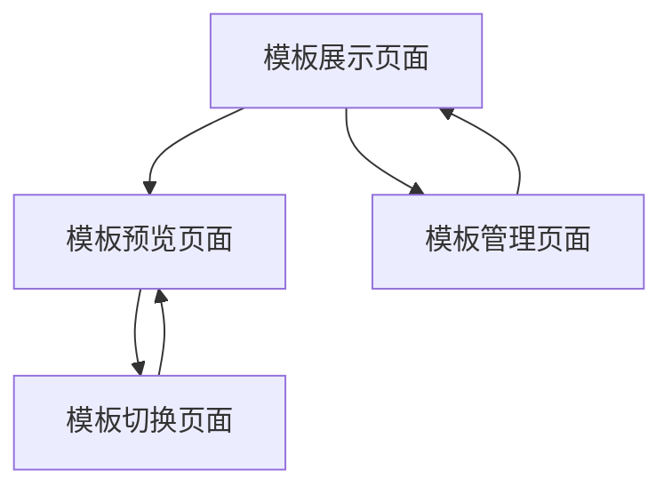

# 模板管理系统产品需求文档

## 1. 产品概述

一个功能强大的模板管理系统，支持自动检测发现模板配置和文件，按名称和设备类型进行分类管理，提供动态渲染和实时切换功能。

- 解决模板分散管理、手动配置复杂、切换不便等问题，为开发者提供统一的模板管理和渲染解决方案。
- 目标是成为Vue生态系统中最强大的模板管理库，后续扩展支持多框架。

## 2. 核心功能

### 2.1 用户角色

| 角色 | 使用方式 | 核心权限 |
|------|----------|----------|
| 开发者 | 直接集成使用 | 可以使用所有模板管理功能，包括扫描、渲染、切换等 |
| 模板贡献者 | 按规范创建模板 | 可以创建符合规范的模板文件和配置 |

### 2.2 功能模块

我们的模板管理系统包含以下主要页面：

1. **模板展示页面**：模板列表展示、分类筛选、搜索功能
2. **模板预览页面**：单个模板详细预览、实时渲染展示
3. **模板切换页面**：同类型模板快速切换、对比展示
4. **模板管理页面**：模板配置管理、状态监控
5. **Vue集成接口**：hook函数、provider组件、模板选择器弹窗

### 2.3 页面详情

| 页面名称 | 模块名称 | 功能描述 |
|----------|----------|----------|
| 模板展示页面 | 模板列表 | 展示所有可用模板，支持按名称分类（login、dashboard等）和设备类型分类（desktop、mobile、tablet） |
| 模板展示页面 | 分类筛选 | 提供多级筛选功能，快速定位目标模板 |
| 模板展示页面 | 搜索功能 | 支持模板名称、标签、描述的模糊搜索 |
| 模板预览页面 | 实时渲染 | 动态加载并渲染选中的模板，支持TSX组件和Less样式 |
| 模板预览页面 | 模板信息 | 显示模板的基本信息、配置参数、使用说明 |
| 模板切换页面 | 快速切换 | 在同一分类和设备类型下快速切换不同模板 |
| 模板切换页面 | 对比展示 | 支持多个模板并排对比展示 |
| 模板管理页面 | 自动扫描 | 使用import.meta.glob自动扫描指定路径下的模板文件 |
| 模板管理页面 | 配置管理 | 管理模板的配置信息、加载状态、错误处理 |
| 模板管理页面 | 缓存管理 | 管理已加载模板的缓存，优化性能 |
| Vue集成接口 | Hook函数 | 提供useTemplate hook进行模板管理，支持响应式模板状态 |
| Vue集成接口 | Provider组件 | 提供TemplateProvider组件用于模板上下文，自动默认模板渲染 |
| Vue集成接口 | 模板选择器弹窗 | 弹窗组件显示并选择当前分类和设备类型下的可用模板 |

## 3. 核心流程

**开发者使用流程：**
1. 初始化模板管理器，自动扫描模板目录
2. 在模板展示页面浏览可用模板，使用筛选和搜索功能
3. 选择目标模板进入预览页面，查看实时渲染效果
4. 在切换页面中快速切换同类型的其他模板
5. 通过管理页面监控模板状态和性能

**模板贡献者流程：**
1. 按照规范创建模板目录结构
2. 编写index.ts配置文件、TSX组件和Less样式
3. 系统自动检测并加载新模板



## 4. 用户界面设计

### 4.1 设计风格

- **主色调**：#1890ff（蓝色）、#52c41a（绿色）
- **辅助色**：#f0f0f0（浅灰）、#ffffff（白色）
- **按钮样式**：圆角按钮，支持悬停和点击效果
- **字体**：-apple-system, BlinkMacSystemFont, 'Segoe UI', Roboto, 14px主要字体，12px辅助字体
- **布局风格**：卡片式布局，顶部导航栏，左侧分类面板
- **图标风格**：使用简洁的线性图标，支持主题色彩

### 4.2 页面设计概览

| 页面名称 | 模块名称 | UI元素 |
|----------|----------|--------|
| 模板展示页面 | 模板列表 | 网格布局的模板卡片，每个卡片显示模板缩略图、名称、分类标签，悬停显示更多信息 |
| 模板展示页面 | 分类筛选 | 左侧树形分类面板，支持展开收起，选中状态高亮显示 |
| 模板预览页面 | 实时渲染 | 中央大面积预览区域，支持响应式预览，右侧参数配置面板 |
| 模板切换页面 | 快速切换 | 顶部标签页式切换，底部缩略图快速选择 |
| 模板管理页面 | 配置管理 | 表格形式显示模板状态，支持排序和筛选，操作按钮组 |
| Vue集成接口 | Hook函数 | 响应式状态指示器，加载状态，错误处理 |
| Vue集成接口 | Provider组件 | 无缝模板容器，自动设备检测指示器 |
| Vue集成接口 | 模板选择器弹窗 | 模态覆盖层，模板网格，选择按钮，搜索过滤器 |

### 4.3 Vue集成规范

#### 4.3.1 Hook使用方式 (useTemplate)
```typescript
const {
  currentTemplate,     // 当前渲染的模板
  availableTemplates,  // 可用模板列表
  isLoading,          // 加载状态
  switchTemplate,     // 切换模板方法
  showSelector        // 显示选择器方法
} = useTemplate('login', {
  defaultTemplates: {
    desktop: 'default',
    mobile: 'simple',
    tablet: 'compact'
  },
  autoSwitchByDevice: true,
  storageKey: 'user-template-preferences'
})
```

#### 4.3.2 Provider组件使用方式
```vue
<TemplateProvider 
  category="login"
  :default-templates="{
    desktop: 'default',
    mobile: 'simple', 
    tablet: 'compact'
  }"
  :auto-switch-by-device="true"
  storage-key="user-template-preferences"
>
  <!-- 模板内容会自动渲染在这里 -->
  <template #selector="{ templates, onSelect }">
    <!-- 自定义模板选择器 -->
  </template>
</TemplateProvider>
```

#### 4.3.3 模板选择器功能
- 弹窗式模板选择器，显示当前分类和设备类型下的所有可用模板
- 支持模板预览和实时切换
- 自动保存用户选择到本地存储
- 支持设备类型自动切换（监听窗口大小变化）
- 提供搜索和过滤功能

### 4.4 响应式设计

桌面优先设计，支持移动端自适应，在移动设备上优化触摸交互体验，分类面板在小屏幕上收起为抽屉式导航。Vue集成会自动检测设备类型变化，当启用自动切换时会相应地切换模板。