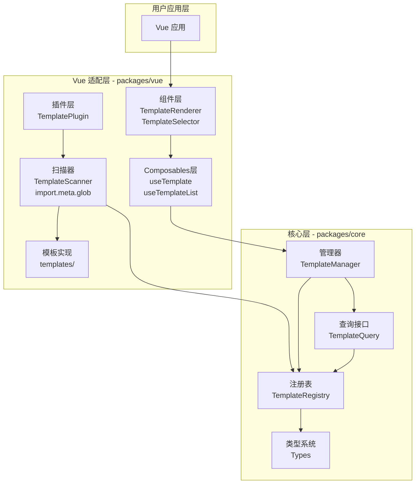
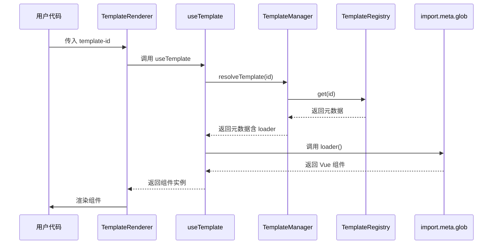
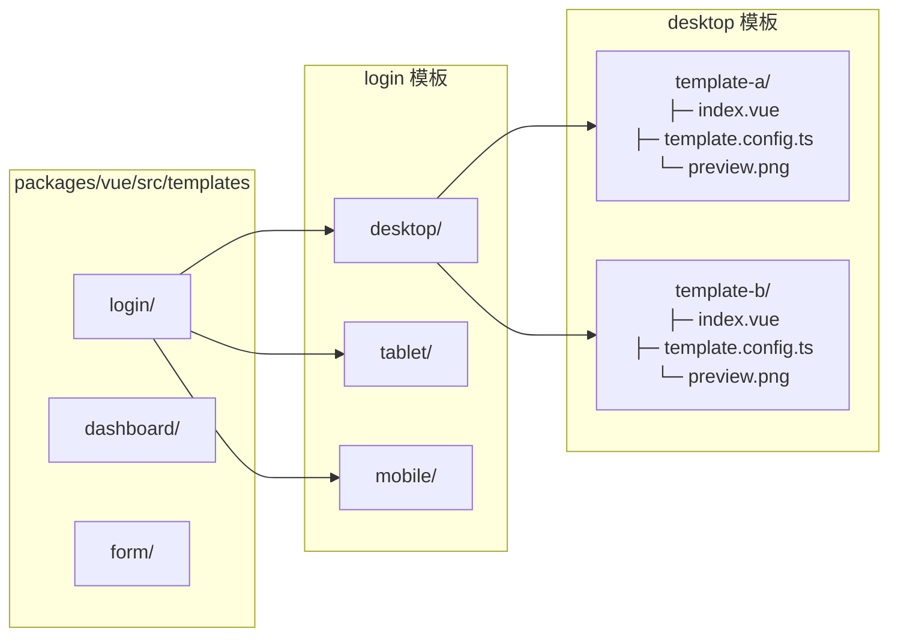
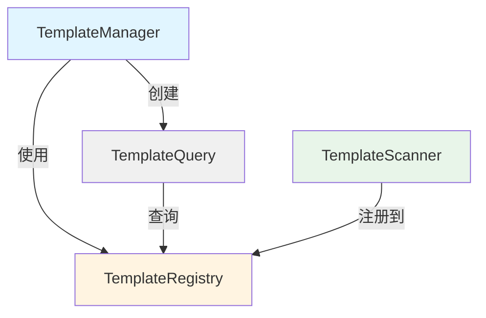
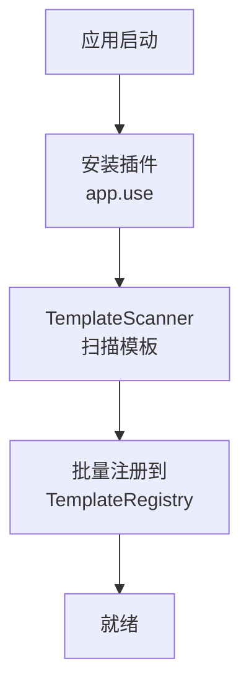
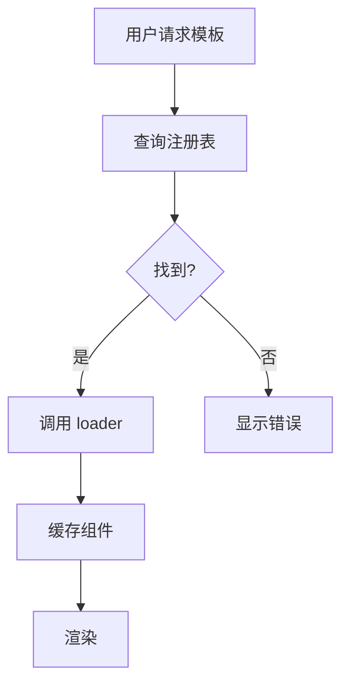

# 多模板管理系统 - Monorepo 架构说明

## 🎯 重构概览

将现有单包 `@ldesign/template` 重构为 Monorepo 架构:
- **packages/core**: 框架无关的核心逻辑
- **packages/vue**: Vue 3 框架适配层及模板实现

## 📊 系统架构图

### 整体分层架构



### 模板加载流程



### 模板目录结构



## 🔑 核心技术方案

### 1. import.meta.glob 动态扫描

```typescript
// packages/vue/src/scanner/TemplateScanner.ts

export class TemplateScanner {
  // 懒加载组件
  private lazyComponents = import.meta.glob(
    '../templates/**/{desktop,mobile,tablet}/*/index.vue',
    { eager: false }
  )

  // 预加载配置
  private eagerConfigs = import.meta.glob(
    '../templates/**/{desktop,mobile,tablet}/*/template.config.ts',
    { eager: true, import: 'default' }
  )

  scan(): TemplateMetadata[] {
    // 扫描并生成模板元数据
  }
}
```

**优势:**
- ✅ 运行时自动发现模板,无需手动注册
- ✅ 支持懒加载,按需加载组件
- ✅ 开发时热更新,新增模板自动识别
- ✅ Vite 原生支持,无需额外配置

### 2. 三级目录结构

```
功能分类 → 设备类型 → 模板名称
   ↓         ↓          ↓
 login  → desktop → template-a
```

**映射规则:**
- 模板 ID: `{category}:{device}:{name}`
- 示例: `login:desktop:default`

### 3. 核心类依赖关系



## 📦 包依赖关系

```mermaid
graph LR
    subgraph Workspace[ldesign/packages/template]
        ROOT[根 package.json]
    end

    subgraph Core[packages/core]
        CORE_PKG[@ldesign/template-core]
    end

    subgraph Vue[packages/vue]
        VUE_PKG[@ldesign/template-vue]
    end

    subgraph External[外部依赖]
        VUE_DEP[vue ^3.3.0]
        VUEUSE[@vueuse/core]
    end

    ROOT -->|workspace| CORE_PKG
    ROOT -->|workspace| VUE_PKG
    VUE_PKG -->|依赖| CORE_PKG
    VUE_PKG -->|peerDep| VUE_DEP
    VUE_PKG -->|依赖| VUEUSE
```

## 🚀 使用流程

### 初始化流程



### 运行时加载流程



## 💡 关键设计决策

### 为什么选择 Monorepo?

1. **关注点分离**: Core 包保持框架无关,可用于其他框架适配
2. **独立版本管理**: 两个包可以独立发版
3. **类型共享**: Core 包提供类型定义,Vue 包直接使用
4. **代码复用**: 避免重复实现

### 为什么使用 import.meta.glob?

1. **自动发现**: 无需手动维护模板列表
2. **懒加载**: 提升初始加载性能
3. **类型安全**: TypeScript 支持良好
4. **Vite 原生**: 无需额外配置或插件

### 为什么是三级目录?

1. **清晰的分类**: 功能 → 设备 → 变体
2. **易于扩展**: 新增功能或设备类型很简单
3. **符合直觉**: 目录结构即是模板组织方式
4. **方便查询**: 支持多维度查询

## 📈 性能优化策略

### 1. 懒加载
- 组件按需加载,不在初始化时全部加载
- 使用 `import.meta.glob({ eager: false })`

### 2. 配置预加载
- 配置文件在构建时加载,用于快速展示列表
- 使用 `import.meta.glob({ eager: true })`

### 3. 索引优化
- Registry 使用 Map 存储,O(1) 查询
- 按分类、设备类型建立索引,加速过滤查询

### 4. 组件缓存
- 使用 `shallowRef` 避免深层响应式
- 已加载组件缓存,避免重复加载

## 🔄 迁移路径

### 对于现有用户

```mermaid
graph LR
    OLD[@ldesign/template<br/>单包]
    NEW_CORE[@ldesign/template-core]
    NEW_VUE[@ldesign/template-vue]

    OLD -.重构为.-> NEW_CORE
    OLD -.重构为.-> NEW_VUE

    style OLD fill:#ffebee
    style NEW_CORE fill:#e8f5e9
    style NEW_VUE fill:#e3f2fd
```

**迁移步骤:**
1. 替换依赖: `@ldesign/template` → `@ldesign/template-vue`
2. API 保持兼容,无需修改代码
3. 如果只使用类型,可以只安装 `@ldesign/template-core`

## 🎯 实施里程碑

```mermaid
gantt
    title Monorepo 重构时间线
    dateFormat X
    axisFormat %d

    section 基础设施
    Monorepo 结构        :done, 0, 1
    Core 包搭建          :done, 1, 2

    section Core 实现
    类型定义             :active, 2, 1
    Registry 实现        :3, 1
    Manager 实现         :4, 1

    section Vue 实现
    Scanner 实现         :5, 1
    Composables 实现     :6, 2
    组件实现             :8, 2

    section 收尾
    测试                 :10, 2
    文档                 :12, 1
```



## ✅ 验收标准

### 功能完整性
- [ ] 所有核心 API 实现完毕
- [ ] Vue 组件和 Composables 工作正常
- [ ] 模板动态加载和渲染成功

### 性能指标
- [ ] 初始加载时间 < 100ms
- [ ] 模板切换时间 < 50ms
- [ ] 包体积 core < 20KB, vue < 50KB

### 质量保证
- [ ] 测试覆盖率 > 80%
- [ ] TypeScript 类型完整
- [ ] 无 ESLint 错误

### 文档完善
- [ ] API 文档齐全
- [ ] 使用示例清晰
- [ ] 迁移指南详细

---

**最后更新**: 2025-11-28
**文档版本**: 1.0.0