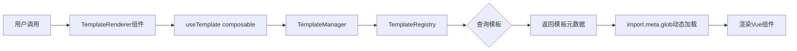

# 多模板管理系统 Monorepo 重构方案

## 🎯 重构目标

将现有的单包结构重构为 **Monorepo** 架构,实现:
- **packages/core**: 框架无关的核心逻辑
- **packages/vue**: Vue 3 框架适配层
- 使用 **import.meta.glob** 实现运行时动态加载
- 保持高性能和类型安全

---

## 🏗️ 系统架构设计

### 整体架构图

```mermaid
graph TB
    subgraph WorkspaceRoot[项目根目录]
        PNPM[pnpm-workspace.yaml]
        ROOT_PKG[package.json]
        TSCONFIG[tsconfig.json]
    end

    subgraph CorePackage[packages/core]
        CORE_TYPES[types/ - 类型定义]
        CORE_REGISTRY[registry/ - 模板注册表]
        CORE_MANAGER[manager/ - 模板管理器]
        CORE_QUERY[query/ - 查询接口]
        CORE_UTILS[utils/ - 工具函数]
    end

    subgraph VuePackage[packages/vue]
        VUE_SCANNER[scanner/ - 模板扫描器]
        VUE_COMPONENTS[components/ - Vue组件]
        VUE_COMPOSABLES[composables/ - 组合式函数]
        VUE_TEMPLATES[templates/ - 模板实现]
        VUE_PLUGIN[plugin/ - Vue插件]
    end

    subgraph Templates[templates/ 三级目录结构]
        T_LOGIN[login/]
        T_DASHBOARD[dashboard/]
        T_FORM[form/]
        
        T_LOGIN --> T_LOGIN_DESKTOP[desktop/]
        T_LOGIN --> T_LOGIN_MOBILE[mobile/]
        T_LOGIN --> T_LOGIN_TABLET[tablet/]
        
        T_LOGIN_DESKTOP --> T_TEMPLATE_A[template-a/]
        T_LOGIN_DESKTOP --> T_TEMPLATE_B[template-b/]
    end

    ROOT_PKG --> CorePackage
    ROOT_PKG --> VuePackage
    CorePackage --> VuePackage
    VuePackage --> Templates
    VUE_SCANNER -.import.meta.glob.-> Templates
```

### 核心数据流



---

## 📁 目录结构设计

```
ldesign/packages/template/
├── pnpm-workspace.yaml          # pnpm workspace 配置
├── package.json                 # 根 package.json
├── tsconfig.json               # 根 TypeScript 配置
├── tsconfig.base.json          # 共享 TypeScript 配置
├── .eslintrc.js                # 共享 ESLint 配置
├── vitest.config.ts            # 测试配置
│
├── packages/
│   ├── core/                   # 🔷 核心包 (框架无关)
│   │   ├── package.json
│   │   ├── tsconfig.json
│   │   ├── src/
│   │   │   ├── types/
│   │   │   │   ├── template.ts          # 模板类型定义
│   │   │   │   ├── registry.ts          # 注册表类型
│   │   │   │   ├── query.ts             # 查询类型
│   │   │   │   └── index.ts
│   │   │   ├── registry/
│   │   │   │   ├── TemplateRegistry.ts  # 模板注册表实现
│   │   │   │   └── index.ts
│   │   │   ├── manager/
│   │   │   │   ├── TemplateManager.ts   # 模板管理器
│   │   │   │   └── index.ts
│   │   │   ├── query/
│   │   │   │   ├── TemplateQuery.ts     # 查询接口实现
│   │   │   │   └── index.ts
│   │   │   ├── utils/
│   │   │   │   ├── path.ts              # 路径工具
│   │   │   │   ├── validation.ts        # 验证工具
│   │   │   │   └── index.ts
│   │   │   └── index.ts                 # 主入口
│   │   └── __tests__/                   # 测试文件
│   │
│   └── vue/                    # 🔶 Vue 适配包
│       ├── package.json
│       ├── tsconfig.json
│       ├── vite.config.ts
│       ├── src/
│       │   ├── scanner/
│       │   │   ├── TemplateScanner.ts   # 基于 import.meta.glob 的扫描器
│       │   │   └── index.ts
│       │   ├── components/
│       │   │   ├── TemplateRenderer.vue # 模板渲染组件
│       │   │   ├── TemplateSelector.vue # 模板选择器组件
│       │   │   └── index.ts
│       │   ├── composables/
│       │   │   ├── useTemplate.ts       # 模板使用 hook
│       │   │   ├── useTemplateList.ts   # 模板列表 hook
│       │   │   ├── useTemplateLoader.ts # 模板加载 hook
│       │   │   └── index.ts
│       │   ├── plugin/
│       │   │   ├── TemplatePlugin.ts    # Vue 插件
│       │   │   └── index.ts
│       │   ├── templates/               # 🎨 模板实现
│       │   │   ├── login/
│       │   │   │   ├── desktop/
│       │   │   │   │   ├── template-a/
│       │   │   │   │   │   ├── index.vue           # 组件实现
│       │   │   │   │   │   ├── template.config.ts  # 模板配置
│       │   │   │   │   │   └── preview.png         # 预览图
│       │   │   │   │   └── template-b/
│       │   │   │   ├── mobile/
│       │   │   │   │   └── template-a/
│       │   │   │   └── tablet/
│       │   │   │       └── template-a/
│       │   │   ├── dashboard/
│       │   │   │   └── desktop/
│       │   │   │       └── template-x/
│       │   │   └── form/
│       │   │       └── desktop/
│       │   │           └── template-simple/
│       │   └── index.ts                 # 主入口
│       └── __tests__/                   # 测试文件
│
└── examples/                   # 示例项目
    └── basic-usage/
        ├── package.json
        ├── vite.config.ts
        └── src/
            ├── main.ts
            └── App.vue
```

---

## 🔑 核心技术方案

### 1. import.meta.glob 使用方案

#### 在 packages/vue/src/scanner/TemplateScanner.ts 中:

```typescript
/**
 * 使用 import.meta.glob 扫描所有模板
 * 支持懒加载和预加载两种模式
 */
export class TemplateScanner {
  // 方案 A: 懒加载 (推荐用于生产环境)
  private lazyModules = import.meta.glob(
    '../templates/**/{desktop,mobile,tablet}/*/index.vue',
    { eager: false }
  )

  // 方案 B: 预加载配置文件 (用于快速获取元数据)
  private configModules = import.meta.glob(
    '../templates/**/{desktop,mobile,tablet}/*/template.config.ts',
    { eager: true, import: 'default' }
  )

  /**
   * 从路径解析模板信息
   * 路径格式: ../templates/{category}/{device}/{templateName}/index.vue
   */
  private parseTemplatePath(path: string): TemplateMetadata {
    const match = path.match(/templates\/([^\/]+)\/([^\/]+)\/([^\/]+)\//)
    if (!match) throw new Error(`Invalid template path: ${path}`)
    
    const [, category, device, name] = match
    return {
      id: `${category}:${device}:${name}`,
      category,
      device: device as DeviceType,
      name,
      path,
    }
  }

  /**
   * 扫描并注册所有模板
   */
  async scanAndRegister(registry: TemplateRegistry): Promise<void> {
    for (const [path, loader] of Object.entries(this.lazyModules)) {
      const metadata = this.parseTemplatePath(path)
      
      // 如果有配置文件,合并配置
      const configPath = path.replace('index.vue', 'template.config.ts')
      const config = this.configModules[configPath]
      
      registry.register({
        ...metadata,
        ...config,
        loader, // 存储懒加载函数
      })
    }
  }
}
```

#### 在用户项目中使用:

```typescript
// vite.config.ts
import { defineConfig } from 'vite'
import vue from '@vitejs/plugin-vue'

export default defineConfig({
  plugins: [vue()],
  // Vite 会自动处理 import.meta.glob
})
```

### 2. 模板配置格式

```typescript
// template.config.ts
import type { TemplateConfig } from '@ldesign/template-core'

export default {
  name: 'default',
  displayName: '默认登录模板',
  description: '简洁的居中式登录页面',
  author: 'ldesign',
  version: '1.0.0',
  preview: './preview.png',
  tags: ['login', 'simple', 'center'],
  // 模板支持的属性
  props: {
    title: { type: String, default: '欢迎登录' },
    logo: { type: String, required: false },
  },
  // 模板依赖 (可选)
  dependencies: [],
} satisfies TemplateConfig
```

---

## 📦 核心 API 设计

### packages/core API

```typescript
// 类型定义
export interface TemplateMetadata {
  id: string                    // 唯一标识: "login:desktop:default"
  category: string              // 功能分类: "login"
  device: DeviceType            // 设备类型: "desktop" | "mobile" | "tablet"
  name: string                  // 模板名称: "default"
  displayName?: string          // 显示名称
  description?: string          // 描述
  path: string                  // 文件路径
  loader?: () => Promise<any>   // 懒加载函数
  preview?: string              // 预览图
  tags?: string[]               // 标签
  version?: string              // 版本
}

// 注册表
export class TemplateRegistry {
  register(metadata: TemplateMetadata): void
  registerBatch(metadataList: TemplateMetadata[]): void
  unregister(id: string): void
  get(id: string): TemplateMetadata | undefined
  getAll(): TemplateMetadata[]
  has(id: string): boolean
  clear(): void
}

// 管理器
export class TemplateManager {
  constructor(registry: TemplateRegistry)
  query(): TemplateQuery
  getTemplate(id: string): TemplateMetadata | undefined
  getTemplatesByCategory(category: string): TemplateMetadata[]
  getTemplatesByDevice(device: DeviceType): TemplateMetadata[]
  getTemplatesByCategoryAndDevice(category: string, device: DeviceType): TemplateMetadata[]
}

// 查询接口
export class TemplateQuery {
  byId(id: string): this
  byCategory(category: string): this
  byDevice(device: DeviceType): this
  byTag(tag: string): this
  execute(): TemplateMetadata[]
  first(): TemplateMetadata | undefined
}
```

### packages/vue API

```typescript
// 组件
export { TemplateRenderer, TemplateSelector }

// Composables
export function useTemplate(id: string | Ref<string>) {
  const template = ref<TemplateMetadata>()
  const component = shallowRef<Component>()
  const loading = ref(false)
  const error = ref<Error>()

  async function load(): Promise<void>
  
  return { template, component, loading, error, load }
}

export function useTemplateList(category: string, device?: DeviceType) {
  const templates = ref<TemplateMetadata[]>([])
  const loading = ref(false)

  function refresh(): void
  
  return { templates, loading, refresh }
}

// Vue 插件
export function createTemplatePlugin(options?: TemplatePluginOptions) {
  return {
    install(app: App) {
      // 自动扫描并注册模板
      // 提供全局 API
    }
  }
}
```

---

## 🎨 使用示例

### 基础使用

```vue
<script setup lang="ts">
import { TemplateRenderer } from '@ldesign/template-vue'
import { ref } from 'vue'

const templateId = ref('login:desktop:default')
const templateProps = {
  title: '欢迎登录',
  onSubmit: (data) => console.log(data)
}
</script>

<template>
  <TemplateRenderer 
    :template-id="templateId"
    :props="templateProps"
  />
</template>
```

### 模板选择器

```vue
<script setup lang="ts">
import { TemplateSelector, TemplateRenderer } from '@ldesign/template-vue'
import { ref } from 'vue'

const selectedTemplate = ref('login:desktop:default')
</script>

<template>
  <div>
    <TemplateSelector
      category="login"
      device="desktop"
      v-model="selectedTemplate"
      show-preview
    />
    
    <TemplateRenderer
      :template-id="selectedTemplate"
      :props="{ title: '登录系统' }"
    />
  </div>
</template>
```

### 使用 Composables

```vue
<script setup lang="ts">
import { useTemplate, useTemplateList } from '@ldesign/template-vue'
import { ref } from 'vue'

// 加载单个模板
const { component, loading, error, load } = useTemplate('login:desktop:default')

// 获取模板列表
const { templates } = useTemplateList('login', 'desktop')

onMounted(() => load())
</script>

<template>
  <div v-if="loading">加载中...</div>
  <div v-else-if="error">错误: {{ error.message }}</div>
  <component v-else-if="component" :is="component" />
</template>
```

---

## 🔧 构建配置

### pnpm-workspace.yaml

```yaml
packages:
  - 'packages/*'
  - 'examples/*'
```

### packages/core/package.json

```json
{
  "name": "@ldesign/template-core",
  "version": "1.0.0",
  "type": "module",
  "main": "./dist/index.cjs",
  "module": "./dist/index.js",
  "types": "./dist/index.d.ts",
  "exports": {
    ".": {
      "types": "./dist/index.d.ts",
      "import": "./dist/index.js",
      "require": "./dist/index.cjs"
    }
  },
  "scripts": {
    "build": "tsup src/index.ts --format esm,cjs --dts",
    "dev": "tsup src/index.ts --format esm,cjs --dts --watch"
  },
  "devDependencies": {
    "tsup": "^8.0.0",
    "typescript": "^5.3.0"
  }
}
```

### packages/vue/package.json

```json
{
  "name": "@ldesign/template-vue",
  "version": "1.0.0",
  "type": "module",
  "main": "./dist/index.cjs",
  "module": "./dist/index.js",
  "types": "./dist/index.d.ts",
  "exports": {
    ".": {
      "types": "./dist/index.d.ts",
      "import": "./dist/index.js",
      "require": "./dist/index.cjs"
    },
